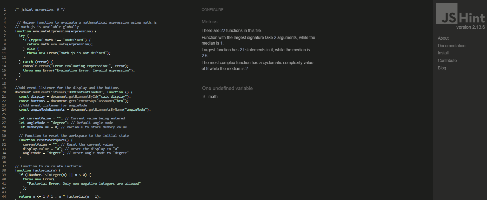

# Scientific Calculator Application


## Contents

- [Scientific Calculator Application](#scientific-calculator-application)
- [Contents](#contents)
- [User Experience (UX)](#user-experience-ux)
  - [Initial Discussion](#initial-discussion)
  - [User Stories](#user-stories)
- [Design](#design)
  - [Colour Scheme](#colour-scheme)
  - [Typography](#typography)
  - [Imagery](#imagery)
  - [Wireframes](#wireframes)
  - [Features](#features)
  - [Accessibility](#accessibility)
- [Technologies Used](#technologies-used)
  - [Languages Used](#languages-used)
  - [Frameworks, Libraries & Programs Used](#frameworks-libraries--programs-used)
- [Deployment & Local Development](#deployment--local-development)
  - [Deployment](#deployment)
  - [Local Development](#local-development)
    - [How to Fork](#how-to-fork)
    - [How to Clone](#how-to-clone)
- [Testing](#testing)
  - [W3C Validator](#w3c-validator)
  - [JSHint](#jshint)
  - [Solved Bugs](#solved-bugs)
  - [Known Bugs](#known-bugs)
  - [Testing User Stories](#testing-user-stories)
  - [Lighthouse](#lighthouse)
  - [Thank You Page](#thank-you-page)
  - [Full Testing](#full-testing)
- [Credits](#credits)
  - [Code Used](#code-used)
  - [Content](#content)
  - [Media](#media)
  - [Acknowledgments](#acknowledgments)

---

## Scientific Calculator Application

This Scientific Calculator application is a fully functional calculator designed for advanced mathematical operations. Built with HTML, CSS, and JavaScript, it includes features for trigonometric calculations, logarithms, factorials, memory functions, and more, all wrapped in a responsive Bootstrap-powered interface.

## User Experience (UX)

### Initial Discussion
This section outlines the purpose of the scientific calculator, its target audience, and the primary goals of its functionality. It includes discussions on user needs and the problem-solving approach.
The primary goal of the Scientific Calculator application is to provide users with a powerful and user-friendly tool for performing advanced mathematical operations. The application is designed to be intuitive and accessible, ensuring that both casual users and professionals can benefit from its features.

### User Stories
1. **As a student**, I want a scientific calculator capable of performing trigonometric and logarithmic functions to help with my assignments.
2. **As a teacher**, I want to demonstrate complex calculations to my students, so that they can understand mathematical concepts better.
3. **As a researcher**, I want to perform accurate scientific calculations, so that I can validate my research findings.
4. **As a developer**, I want to use a calculator with keyboard support, so that I can quickly perform operations without using a mouse.
5. **As an engineer**, I need a tool to handle precise calculations for my projects.
6. **As a general user**, I require a simple interface to perform basic and advanced calculations easily.


## Design


### Colour Scheme
The colour scheme for the Scientific Calculator application is chosen to be visually appealing and to provide high contrast for readability with professional colour palette. The primary colours used are:
- **Background**: Light grey
- **Primary Colours**: Navy blue for mathematical operations of addition, subtraction, multiplication and division buttons.
- **Secondary Colours**: Light grey for numbers from 0 to 9 inclusing brackets and point.
- **Accent Colours**: light blue for functionsl operations like trignometric, logarithmic, and memory buttons and red for "Reset" and yellow for "backspace".

### Typography
The application uses a clean and modern font for all text elements to ensure readability. The primary font used is `Poppins`, with `sans-serif` as fallbacks.
Fonts are chosen for clarity and readability:

### Imagery
Imagery is kept to a minimum to maintain a clean and uncluttered interface. Minimal imagery ensures a clean design. buttons are used to visually represent their functions.

### Wireframes
Wireframes were created to outline the basic layout and functionality of the application. These include the arrangement of buttons, display, and additional features like memory functions and angle mode.
Wireframes depict responsive layouts for desktop, tablet, and mobile, ensuring an optimal user experience across devices.
1. Desktop layout
   
3. Tablet layout
   
5. Mobile layout
   
   

### Features
- **Arithmetic Operations**: Addition, subtraction, multiplication, division, and percentage calculations.
- **Trigonometric Functions**: sin, cos, tan (calculates in degrees or radians).
- **Logarithmic Functions**: ln (natural logarithm) and log (base-10 logarithm).
- **Exponential and Power Operations**: Includes exponentiation (x^y) and square roots.
- **Constants**: Includes π and Euler's constant e.
- **Factorial Calculation**: Computes factorial for non-negative integers.
- **Random Number Generator**: Generates a random number between 0 and 1.
- **Memory Functions**:
  - M+: Add to memory.
  - M-: Subtract from memory.
  - MR: Recall memory value.
  - MC: Clear memory.
- **Angle Mode Selection**: Toggle between degrees and radians.
- **Input Flexibility**:
  - Button clicks.
  - Keyboard input for numbers, operators, and functions.
- **Error Handling**: Displays appropriate error messages for invalid inputs or operations.

### Accessibility
The application is designed to be accessible to all users, including those with disabilities. Features include:
- High contrast colour scheme for readability.
- Keyboard support for all operations.
- Clear error messages for invalid inputs.

## Technologies Used

### Languages Used
- HTML5
- CSS3
- JavaScript

### Frameworks, Libraries & Programs Used
- [Bootstrap](https://getbootstrap.com/): For responsive design and styling.
- [math.js](https://mathjs.org/): For evaluating mathematical expressions safely.
- **Google DevTools - console**: For JavaScript testing.
- **JSHint**: For JavaScript validating.

## Deployment & Local Development

### Deployment
The application can be deployed on any web server. Simply upload the project files to the server, and it will be accessible via a web browser.
The application is live on GitHub Pages. [View live site here](https://yohannes2025.github.io/project-2.2/).

### Local Development

#### How to Fork
1. Log in to GitHub and navigate to the repository.
2. Click the "Fork" button in the top right corner.
3. The repository will be forked to your account.

#### How to Clone
1. Navigate to your forked repository on GitHub.
2. Click the "Code" button and copy the repository URL.
3. Open your terminal and run:
    ```bash
    git clone <repository-url>
    ```
4. Navigate to the project directory:
    ```bash
    cd scientific-calculator
    ```
5. Open the `index.html` file in your browser to use the calculator.


## Testing

### W3C Validator
- The HTML and CSS files were validated using the W3C Markup Validator and CSS Validator to ensure there are no syntax errors.
1. HTML validation
   
3. CSS validation
   

### JSHint
- Checked JavaScript code for errors and best practices.
- Here is the test result
  

### Solved Bugs
- Fixed issue with negative numbers in factorial calculations.
- Resolved keyboard input conflicts.
- Corrected error message display for invalid operations.

### Known Bugs
- We need to reset the workspace by clicking the AC button or by pressing the Escape key on the keyboard to start new calculation.
- There is a warning by jshint.com for using eval to calculate the expressions.

### Testing User Stories
1. **Student**: Successfully performed various mathematical operations.
2. **Teacher**: Demonstrated complex calculations without issues.
3. **Researcher**: Validated research findings with accurate calculations.
4. **Developer**: Used keyboard support for quick operations.

### Lighthouse
- Lighthouse tests were conducted to ensure the application meets performance, accessibility, and best practices standards. Here is the result
  

### Thank You Page
- I would like to thank for the whole code Institute Team members for tutoring, mentoring and quick responses whenever I require technical help.

### Full Testing
- A comprehensive testing plan was executed, covering all features and functionalities of the application. This included unit tests for individual functions and integration tests for overall user experience.

## Credits

### Code Used
- Utilized [math.js](https://mathjs.org/) for mathematical expression evaluation replacing eval function which is not safe.
- Utilized [Scientific calculator - live](https://github.com/sydney-jovian/scientific-calculator-live/tree/main) for the begining of initial setup.
- Utilized [Regular expressions](https://stackoverflow.com/questions/1144783/how-do-i-replace-all-occurrences-of-a-string-in-javascript/17606289#17606289) for replacing all occurrences of a string in JavaScript.
- Utilized [Wikipedia](https://en.wikipedia.org/wiki/Glossary_of_mathematical_symbols) for mathematical symbols representation.


### Content
- Utilized [FreecodeCamp](https://www.freecodecamp.org/news/how-to-build-an-html-calculator-app-from-scratch-using-javascript-4454b8714b98/) for the idea of how to build Scientifica Calculator from JavaScript.


### Acknowledgments
- Special thanks to online tutorials, and mentors of Code Institute communities for guidance and folowups.
